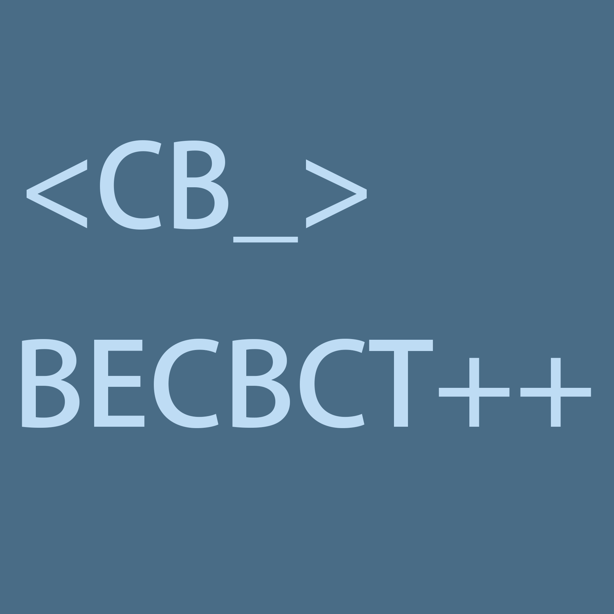

# BECBCT++     
- A better Bedrock Edition Command Block's Convenient Commands Importing Tool.
- This project belongs to the second phase of the command block import plan.
- If you want to use it,please see [Wiki](https://github.com/Blukdev/BECBCTPP/wiki).
 

